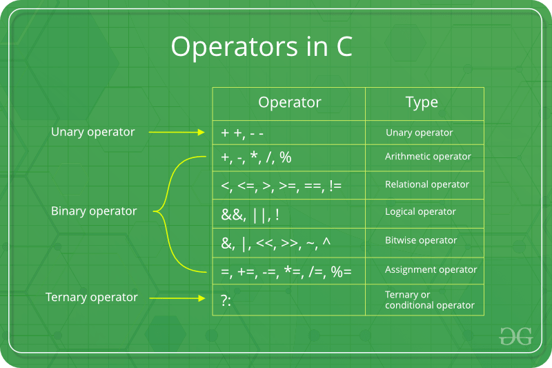

# STEP_session_3
Intro to Programming
The purpose of this session is to provide a brief introduction to programming assuminh no prior experience. Programming, and more generally computer science, is an extremely deep field and only so much can be covered in a single session. With that being said, this repo should give a solid overview and provide starter code that can easily be extended by a motivated student.

## Variables

## Operators

## Conditional Logic

### If statements

### If Else statements

### If Elif Else statements

## Loops

### For Loops

### While Loops

## Resources / References

