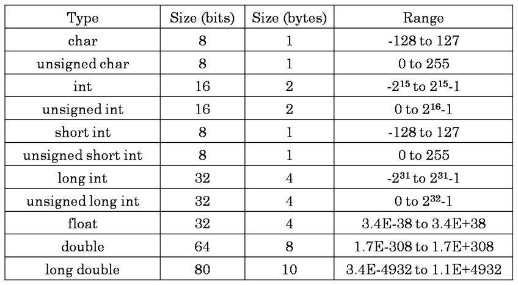
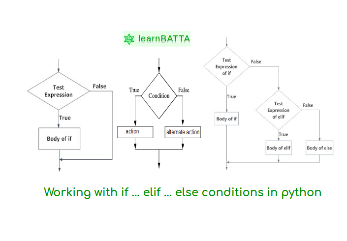

# STEP_session_3
Intro to Programming

## Variables

## Operators

## Conditional Logic

### If statements

### If Else statements

### If Elif Else statements

## Loops

### For Loops

### While Loops
