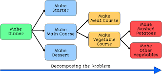
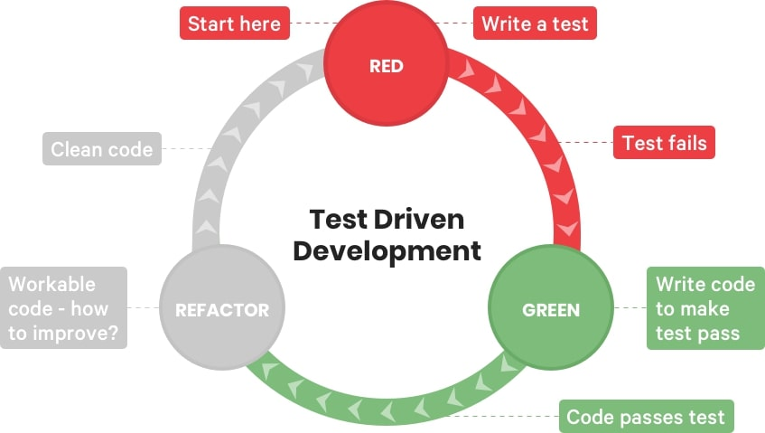

# STEP session 3
## The big picture
Programming is a means of getting a computer to complete a pre-specified task. In order for a computer to complete a task, it must be told EXACTLY what to do by the computer programmer. Computer programmers (like yourself) use programming languages (like C, Python, or Javascript) to solve interesting computational problems(problems that involve math). 

More specifically, a programmer comes up with algorithms and data structures that can effectively store problem relevant information and operate on that information in some interesting fashion. An algorithm is a step by step process that does a certain task, as long as some set of preconditions are satisfied. For example, one could view cleaning their clothes in an algorithmic sense. First, we store our clothes in a bin. If the bin is full, then we transfer the clothes from the bin into the washing machine. After that, we place soap into the machine, close the lid, and start the washing machine. When the washing machine is done, we transfer the clothes from the washer to the dryer, throw in some dryer sheets, close the dryer, and start the dryer. Lastly, the clothes from the dryer are transfered to your room for future use. This may be the longest winded explanation of laundry you have ever received, but I did it in this way to show you how much goes into explaining even a simple concept such as doing the laundry. The goal of a programmer is to come up with interesting solutions to problems / do interesting things, and to do these things in a manner that is time efficient, memory efficient, energy efficient, elegant, beautiful, meaningful, etc. 

A data structure is a way of storing information. The information we store may be numbers, letters, words, or groupings of these pieces of information. For example, a store might have a data structure that they refer to as a "customer object" which may contain a name, age, gender, list of prior purchases, etc. There are often multiple ways to store information about something, and a programmer must make an informed decision about how information is stored / the data structures that they use, because those decisions will impact the performance of the algorithms they use to do interesting stuff with the information stored in the data structures. Lets go back to the laundry example. After the clothes are brought back to your room, you have a choice for how you want to store your clothes. If you are in a rush, you might just throw your clothes into your drawers at random. While this may mean that you only have to spend a small amount of time storing your clothes, it may leave your clothes wrinkled as well as make it difficult to select an outfit. On the other hand, if you take a little bit more time and fold the clothes and then organize them into drawers, then your clothes will appear nicer and it is easier to select an outfit from the drawers. A super fancy individual might hang up particular clothing items that are prone to wrinkling, which again comes at a time cost but helps further increase appearance of your clothes. Good programmers must make informed tradeoff decisions with data structures based on what they are trying to accomplish with the program as well as what they value.

Our first programs will be composed of variables, conditional logic, and loops. A variable can be thought of as a basic data structure. We use variables to store things like numbers (integers and floats), letters/words (like characters/strings), and booleans (a data type that represents TRUE or FALSE). Conditional logic allows programmers to do a certain series of steps based on the values of the variables at a particular point in time. For example, maybe you want to print a number to the screen as long as it is bigger than a threshold value. One could use an if statement that uses a magnitude operator to check if the number variable is bigger than the threshold value and print the number variable to the screen if it is bigger than the threshold. Finally, loops provide programmers with a way of repeteadly doing things. For example, one might store the value 10 in a variable, then want to decrement the variable and print the value of the variable to the screen as long as the variable is positive. To do this, a programmer might use a while loop that checks if the variable is greater than or equal to zero, then print the value of the variable, then subtract one (ie decrement) the variable. The check is performed again and the variable is repeteadly printed and decremented until the variable is no longer greater than or equal to zero.

# Intro to Programming
The purpose of this session is to provide a brief introduction to programming assuming no prior experience. Programming, and more generally computer science, is an extremely deep field and only so much can be covered in a single session. With that being said, this repo should give a solid overview and provide starter code that can easily be extended by a motivated student.


## Variables
Variables are simply values that can change over time. One of the most important distinctions that one can make between different programming languages is whether or not a language is typed or not. A typed system forces programmers to specify the 'type' of a variable before using that variable. An example of a statically typed language is C/C++. This is contrasted with dynamically typed languages, like Python, that allow variables to change type over time. For example, if I create an integer variable, named x, I cannot later change x to string or a boolean. 

```c
// Example of trying to change a variables type in C
// Try running this code and see what happens
int x = 5;
// do stuff
// do more stuff
x = 5.5        // Cant do this, 5.5 is not an integer
x = True       // Cant do this, True is not an integer
```

Although this code will not work in a statically typed language like C, this type of code is perfectly fine in a language like Python. For example, the code below will run just fine.

```py
# Example of changing a variable from one type to another type in Python
x = 5
# Do stuff
# Do more stuff
x = 5.5
# more stuff
x = True
```

Notice that in Python, we do not have to explicitly declare the type of a variable before we create it. In C, we see that we need to type 'int', 'float', 'double', or some other variable type before creating a variable. While some may appreciate the simplicity of the syntax in Python, every decision has a tradeoff. Dynamically typed languages can be easier to use and pick up, but lots of subtle bugs and errors can happen if one is not mindful of how 


```c
// example variable declarations in C
int x = 5;
double y = 5.6;
char z = 'a';
char* exampleWord = "ZBTHS";
string exampleWord2 = "ZeeBee";
```

## Operators
An operator is used to modify/do something with a variable. Most operators are binary operators, meaning that they operate on two variables at once, but there are unary and ternary operators that work one one and three variables, respectively. Operators typically fall into the categories of arithmetic operators, logical operators, and bit wise operators. Most beginner programmers need only concern themselves with the arithmetic operators and logical operators. Arithmetic operators, such as the plus sign, minus sign, multiplication sign, and division sign are used to perform some sort of calculation on a set of variables. Logical operators, on the other hand, are typically used to encode conditional logic which is used to take different branches of execution based on the values of the variables during runtime. Examples of logical operators include the double ampersand (&&), the double pipe (||), and exclamation point equals sign (!=), which perform logical and, logical or, and does not equal. 


```c
int addResult;
int subtractResult;
int multiplyResult;
int divideResult;
int incrementResult;
int decrementResult;
bool greaterThanResult;
bool lessThanResult;
bool equalsResult;
bool doesNotEqualResult;

int x = 7;
int y = 4;

addResult = x + y;
subtractResult = x - y;
multiplyResult = x * y;
divideResult = x / y;
greaterThanResult = x > y;
lessThanResult = x < y;
equalsResult = x == y;
doesNotEqualResult = x != y;
incrementResult = ++x;
decrementResult = --y;
```

Notice that each language may have slightly different syntax and slightly different sets of features, but they overall accomplish just about the same thing. Although everyone is different, I have personally found that learning some sort of typed language (like Java, C, or C++) is ideal to learn first, since the statically typed to dynamically typed transition is easier for most than the dynamically typed to statically typed transition. Something to note is that although operators are usually operating on variables of the same type, they need not to. For example, if one were to run the following code 

```c
int a = 5;
double b = 5.5;
double c = a + b;  // c should contain 10.5
```

The output would be 10.5, which is what we (hopefully) expected. In this case, an integer and a double are being operated on and yield another double. There are other cases in which an operator is defined for different types of objects. In fact, C and C++ allow users to overload operators to fit the needs of their program, so it is generally best practice to go to the documentation and see how the behaviour of operators is defined. 


## Conditional Logic

Conditional logic is used to take different branches of execution based on the values of the variables during run time. For example, one may want to run a certain branch of code and print a certain message to the console based on the relationship between the variables x and y. For the most part, there are three different types of conditional logic that a beginner programmer should focus on. These are the if statements, if else statements, and if, else if , else statements. 


### If statements

```c
// example if statement in C
int x = 1;
int y = 0;
if (x > y) {
  printf("x is greater than y\n");
}
printf("Code is done running\n");
```

### If Else statements

```c
// example if else statement in C
int x = 1;
int y = 0;
if (x > y) {
  printf("x is greater than y\n");
} else {
  printf("x is not greater than y\n");
}
printf("Code is done running\n");
```

### If Else if Else statements

```c
// example if, else if, else statement in c
int x = 1;
int y = 0;
if (x > y) {
  printf("x is greater than y\n");
} else if(y > x) {
  printf(y is greater than x\n");
} else {
  printf("x is equal to y\n");
}
printf("Code is done running\n");
```

## Loops

Loops are a means of reusing code and avoiding duplicate code. A programmer must have a sufficient degree of laziness or forethought in order to condense their programs to the smallest possible size. This often helps with the performance of the program and the readability of the program. One of the first ways one can learn to condense code is to use loops. Loops are blocks of code that repeatedly execute for a certain number of steps or while a certain logical condition is met. Typically, for loops are used to execute a block for a predefined number of steps, while a while loop typically executes as long as some logical condition remains true or false. It is important to not get too caught up in the distinctions I have made. Look at them as rules of thumb / heuristics moreso than truisms. Interestingly, every for loop can be represented as a while loop, and vice versa. This means that the right looping paradigm to use is the one that correctly solves the problem and comes easieset to you. 

### For Loops

```c
// example for statement in C
for (int x = 0; x < 3; x++) {
  printf("x is %d", x);
}
```

### While Loops

```c
// example while statement in C
int x = 5;
while (x > 0) {
  printf("x is %d", x);
  x--;
}
```
## Soft Skills for progamming
Believe it or not, there is a lot more that goes into computer science than just programming and making computers go "beep boop". Here are some fundamentals that are not directly related to programming that can set a good programmer apart from a great programmer. The quicker you internalize these concepts / incorporate these procresses into your work flow, the quicker you can become a proficient programmer that can write, design, and communicate code. 

### Abstraction + Decomposition

One of the most fundametal skills that a programmer can learn is the process of decomposition. Decomposition is the process of breaking a problem into smaller pieces that can be easily solved and combined to yield the solution to the original problem. A good programmer must make a decision of how they would like to decompose the problem. A good tradeoff is one that breaks the problem into managable sub components that are easy to implement and describe to others. Just like a person would not want to read a book that is just one giant block of text, most programmers do not want to read a program that is one giant block of code. Not only does it make it more difficult to distinguish what each part of the program is doing, but it can make it hard to troubleshoot code unless one is a seasoned debugger. With that being said, being able to effectively decompose problems is one of the most important fundamentals that a programmer can pick up. The best way to practice this skill is to solve problems, go back to them, think of more elegant solutions, and repeat until decomposing a problem is as natural as the methods that you use to solve the problem.



### Test Driven Development (TDD)

Test driven development is a tried and true way of writing code in an effective manner. After one decomposes a problem and has an understanding of how all of the subcomponents of a solution combine to yield the final solution, one must actually go about creating each subcomponent. When doing this, one should think of specific example cases and test their code against those example cases. For example, if I have a list of numbers and need to return all of the numbers in the list greater than 10, then I should create a couple lists that test whether the program can effectively do that. For example, I might create a list with all numbers less than 10 and make sure that no numbers are returned. I might create another list that contains only numberse greater than 10 and make sure that all of the numbers are returned. Finally, I will create a list that contains numbers bigger and smaller than 10 and make sure that it works corrrectly. After those test cases are passed, then one can proceed to the next subcomponent. The point of test driven development is to build robust code from the start so that subtle, time consuming bugs do not pop up in your code later. Some of the most frustrating bugs to troubleshoot are bugs in which you don't know where to look for the issue. Often times, one does not know where to look for the issue in code because they have not adequately decomposed a problem and have a large block of code to inspect for errors, or a programmer completely overlooks a block of code that they assume works correctly but actually has some subtle bugs that prevent the code from working. In either case, test driven development helps minimize the occurence of these stressful conundrums because it makes programmers develop robust code from the get go.



### Navigating Documentation effeciently

## Resources / References
[interactive intro to Git](https://learngitbranching.js.org/) <br>
[practice problems for beginner programmers](https://www.codestepbystep.com/) <br>
[Practical Unix(command line tutorial) playlist by Sam King](https://www.youtube.com/playlist?list=PLAn5BRyzQEf9VoK8gRKp8Z0LGME6fISaE) <br>
[Documentation for all of the major programming languages all at 1 place :)](https://devdocs.io/) <br>
[Tips for reading documentation](https://blog.techtalentsouth.com/8-tips-to-reading-documentation-a-newbies-guide) <br>
[Tips for writing documentation](https://guides.lib.berkeley.edu/how-to-write-good-documentation) <br>
